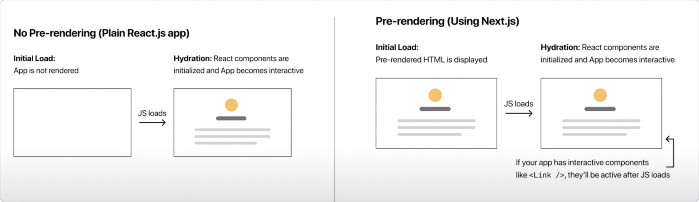
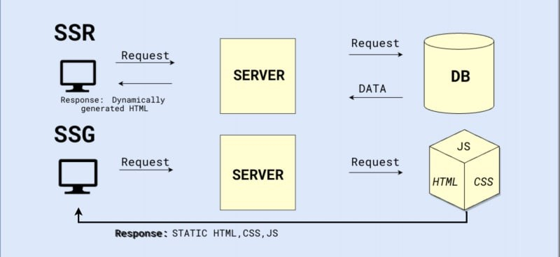

# router

`nextjs router` is based on file system and we don't need to install a dependency like `react-router-dom` so the `pages folder` is the root of our website and `index.jsx` is the main page, for example if you wirte this address in url `localhost:3000` it starts to load `index.jsx` so for other pages like `InfoPage.jsx` or `Products.jsx` you have to write their specific name in url for example if you have a page like pages/Products.jsx you need a url address like this `localhost:3000/Products`

```bash
directory :
pages/index.jsx = localhost:3000/
pages/InfoPage.jsx = localhost:3000/InfoPage
```

prefetch property nested routes

```bash
directory :
pages/user-panel/index.jsx = localhost:3000/user-panel
pages/user-panel/orders.jsx = localhost:3000/user-panel/orders
```

### dynamic routes

a dynamic route is a type of route wich gets parameter from url like this : `route/dynamicParam` -> `route/product-id`
dynamic routes in next.js are known as a file like this -> `[dynamicParam].jsx / [dynamicParam].js`
for example in this architecture we have a nested route as a folder and an index file :

```
pages
|
|__article/
   |
   |__index.jsx
|
|
```

and we added a dynamic route in a nested route .
so in this case our nested route has a dynamic route if we write anything after this addres -> `locallhost:3000/article` like this `locallhost:3000/article/12`, we will navigate to a dynamic route .

```
pages
|
|__article/
   |
   |__index.jsx
   |
   |__[id].jsx
|
|
```

### using parameter in dynamic route

this hook `useRouter()` provides details about a route if it's calld in that, so we can access to dynamic parameter by using `query property` from output of this hook like below :

```jsx
import { useRouter } from "next/router";
function OneArticle() {
  const {
    query: { id }, // here i got id because i created a dynamic route with a (id parameter) like this [id].js
  } = useRouter();
  return <div>show data base on this id {id}</div>;
}
```

### nested dynamic routes

we also can add a dynamic nested as second nested route .
so look at this addrees structure `localhost:3000/admin/[admin-id]/notification` or `localhost:3000/admin/[admin-id]/me` !

- here we have a nested route :

```
pages
|
|__admin/
|
|
```

- and second `nested dynamic route` :
- here `[admin_id]` is a folder as child nested route !

```
pages
|
|__admin/
   |
   |__[admin_id]/
|
|
```

and `notification.jsx` or `me.jsx` are static child routes in `[admin_id]/` so they can access to `[admin_id]` parameter

```
pages
|
|__admin/
   |
   |__[admin_id]/
      |
      |-notification.jsx
      |-me.jsx
|
|
```

```jsx
function notfication() {
  const {
    query: { admin_id },
  } = useRouter();

  return <div>notfication for admin with id : {admin_id}</div>;
}
function me() {
  const {
    query: { admin_id },
  } = useRouter();
  return <div>this is my id : {admin_id}</div>;
}
```

### access to parent route parameter by query propertiey

if you have a complex route architecture and you need to access to older parents .

for example the dynamic route `[pj_id].jsx` needs to access prameter of `[admin_id]` .

```
pages
|
|__admin/
   |
   |__[admin_id]/
      |
      |___projects/
      |   |-index.jsx
      |   |-[pj_id].jsx
      |
      |-notification.jsx
      |-me.jsx
|
```

`[pj_id].jsx` : so this dynamic route able to access to its self and its parent and older parents like `[admin_id]` by using :

```js
const {
  query: { admin_id, pj_id },
} = useRouter();
```

### link component

you must know that how a Link component works in react.js so in next.js its not very diffrenet you need to call it as the same but from next.js not react-router-dom .

so far there is a bit diffrenece it's just `href` insted of `to` .

and you also can pass the prop -> `replace` as a boolean to this component

```js
import Link from "next/link";
function projects() {
  return (
    <div>
      projects
      <br />
      <Link href={"/admin/123/projects/34"}>one project</Link>
    </div>
  );
}
```

if you have a long route address and you want to use a Link component to navigate user to that route, you beter use object for value of `href` instead of `string` :

```jsx
        <Link
          href={{
            pathname: "/admin/[admin_id]/notfication",
            query: {
              admin_id: "23",
            },
          }}
        >
```

### dynamic navigators

there are a few functional and important methods that you can use to navigate user dynamically

in general :

- `back()` dosen't get any parameters it just go back in history
- `push` navigate to a new route
- `replace` navigate and replace to a new route

```js
const { back, push, replace } = useRouter();
function backToHistory() {
  back();
}
function navigator() {
  push("/article/234");
  //  or
  push({
    pathname: "/article/[id]",
    query: {
      id: "1",
    },
  });
}
function replaceRoute() {
  replace("/");
}
```

### How to create a 404 page

in next.js it's very ease you just need to add a `404.js/jsx` file in page directory and you also can create other page errors for example for interval server errors like `500>n` it also follow the same pattern, just create a 500.js/jsx file in page directory and render a customized page .

### geting parameters (Slug)

**geting parameters not only one parameter** for example if you have a dynamic route like `[userid].jsx` and you relize that you need `fullname` and `username` from prameter, so totally they're 3 parameters like `userid/fullname/username` but we got one parameter `userid` so how can we get more than one ?

it's very ease you need just destructure it `[...slug].jsx` insted of get only one like `[userid].jsx` and you can access to it like below :

so it works like this : `p1/p2/p3/more...` pass to `[...slug].jsx` and access to `query.slug` it provides `[p1,p2,p3,more...]` .

```js
function UserDetails() {
  const { query } = useRouter();
  const slug = query.slug || []; // here we said (query.slug || []) because at first it's undefined .

  return <div>{slug.length >= 3 && `${slug[0]}/${slug[1]}/${[slug[2]]}`}</div>;
}
```

# Pre-rendering

### what is the pre-rendering :

you will learn the most important concepts in next.js, if you read the README file until now .

pre-rendering means that browser get prepared html tamplate from server, so it doesn't need to run all of javascript code to render html in browser because the javascript code that cause to render html and content like components are rendred by server before .

picture to make it sence :



i said javascript code run on server but in the picture above we can see the browser still run javascript because next.js only make pre rendered content but it dosn't able to handle state, context, javscript events, and another logic so it means `Hydration` .

`Next.js says` : i give you pre rendered html page content but i don't do somthing to handle the interactive states like `events` , `data-refetching` , `context` , `hook` and ...

but after i gave you pre rendred html page content i add a `<script>` as a chunk that relate to the renderd page

### SSG VS SSR :

- SSR : **_Server side rendering_**
- SSG : **_Static site generation_**

SSR : when you open a page, server try to run jasavscript to render html and fetching data then send it to client and client get a pre-rendred page with data .

SSG : when you write this command `npm run build or next build` yor SSG page generate to html and get data from server while building not running, that's why we said **Static site** because server don't do somthing diffecult just send a static html with real data .

picture to make it sence :



### SSG -> `getStaticProps(){}`

before this part of **pre-rendering concept** we understood how it works, now we wiil uderstand more about `SSG` .

so we uderstood that SSG page only generate in building time but how we can fetch data and make some changes while generating ?

**NOTIC** : next.js build SSG pages by default that means if we dont do somthing for pre-rendering and usualy creating our page components, next.js build theme as SSG pages .

we can export a method with the same name as `getStaticProps` and we can fetch our data in it's scope and we shoud return an object like `{props:{...}}` so we can use reterned props like below :

```js
export default function Home({ data }) {
  return (
    <>
      {data?.map((item) => {
        return <div>item</div>;
      })}
    </>
  );
}

export async function getStaticProps() {
  const res = await fetch("https://jsonplaceholder.typicode.com/posts");
  const data = await res.json();
  return { props: { data: data } };
}
```

**but you shoud know when and where `getStaticProps` runs**, **it runs and start to fetch data while building or developing** **and it always run on server side you can test it jus by a log you will see the result in terminal not browser**.

the SSG page will use fetched data by geting theme from prameters -> `function Home({ data })` so the SSG page is generated with real data from server and it's html template

**RULES**

- `getStaticProps` has to be defined in page directory !
- the name of this method must be `getStaticProps` !
- the basic value to return must be `{props:{}}` !

### SSG -> `getStaticPath(){}`

what if we create a dynamic route and want to make some changes on it while generaring like data fetching base on a parameter, **first look at this example** :

```js
import { useRouter } from "next/router";
import React from "react";

function Products({ data }) {
  return <div>Hello {data.title}</div>;
}

export default Products;

export async function getStaticProps(context) {
  const productID = context.params.id; // << geting dynamic parameter
  const res = await fetch(
    `https://jsonplaceholder.typicode.com/posts/${productID}`
  );
  const data = await res.json();

  return { props: { data: data } };
}
```

it dosen't work and you get error because user might open this dynamic route with diffrenet pramater like `products/id-p-3 , products/id-p-4 , products/id-p-8` and in each request server need to know which page is for this id but in build time server generated just one page -> `[id].html`.

**in general `getStaticProps` says i want to know what id i will get because i need it to fetch data and generate html files for each parameter**

we have to define parameter in dynamic route by exporting `getStaticPaths` this method let us to define parameters as an array so the example below can make it sence :

```js
export async function getStaticPaths() {
  const res = await fetch("https://jsonplaceholder.typicode.com/posts");
  const data = await res.json();
  const paths = data.map((item) => {
    return { params: { id: String(item.id) } };
  });
  return {
    paths,
    fallback: false, // << next part you will be reading about this prop
  };
}
```

for eaxample if `data.map` returns this array :

```js
[
  { params: { id: "id-p-1" } },
  { params: { id: "id-p-2" } },
  { params: { id: "id-p-3" } },
];
```

**in build time next.js start to fetch and provide data for each one so we have 3 html page `id-p-1.html id-p-2.html id-p-3.html` their basic html are the same but their content are diffrent**

### prefetch Link prop

before user click on Link Component we can fetch that route by prefetch={true} but it's by default true and work only in production file .
Eaxample :

```js
import Link from "next/link";
import React from "react";

function Products() {
  return (
    <div>
      <Link href={"/products/1"} prefetch>
        one product
      </Link>
    </div>
  );
}

export default Products;
```
